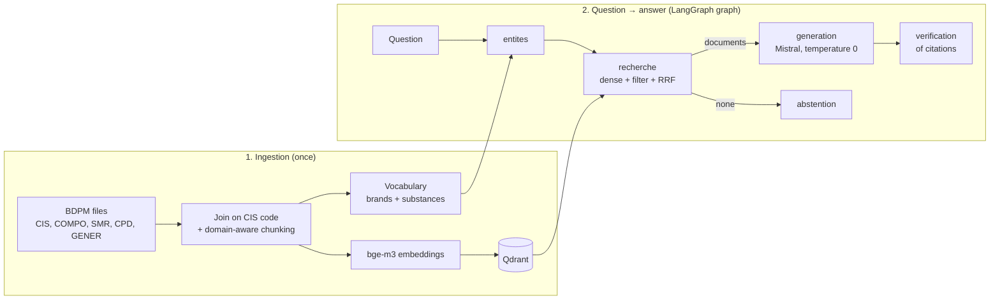

# BDPM-RAG — a source-grounded, fully local drug information assistant

*[Français](README.md) · English*

Question-answering assistant about medicines, built on the **Base de Données Publique des
Médicaments** (BDPM), the official French public drug database published by the ANSM (French
medicines agency), the HAS (French health technology assessment body) and the national health
insurance. It answers **only** from the official data, **cites its sources** (link to the BDPM
record) and **abstains** when the information is not in the database.

Everything runs locally: LLM and embeddings through **Ollama**, vector index in **Qdrant**,
orchestration with **LangGraph**. No data leaves the machine, a common requirement in healthcare.

> **Disclaimer**: technical demonstrator. It does not replace the Summary of Product
> Characteristics (SmPC) or the advice of a healthcare professional.

**Stack**: Python · Ollama (`bge-m3`, `mistral`) · Qdrant · LangGraph · Streamlit · pytest · GitHub Actions

> The data, the generated answers and the user interface are in French. Examples below are quoted
> in French with an English translation.

---

## How RAG works

An LLM on its own answers "from memory": it can be wrong, invent a dosage or rely on outdated
information. **RAG** (*Retrieval-Augmented Generation*) works differently. It first **retrieves**
the relevant passages from a reference database, then asks the LLM to answer **only from those
passages**, citing them.

The project follows the two classic phases of a RAG system.



### Phase 1 — Ingestion (`scripts/ingest.py`)

| Step | What happens | Code |
|---|---|---|
| **1. Collection** | Download of 5 BDPM open data files (tab-separated text, UTF-8 or Windows-1252 encoding handled) | [`bdpm.py`](bdpm_rag/bdpm.py) |
| **2. Join** | Tables are joined on the **CIS code**, the unique identifier of each medicinal product | [`documents.py`](bdpm_rag/documents.py) |
| **3. Domain-aware chunking** | One product is one unit of meaning: **1 "record" chunk** per product (identity, composition, prescribing conditions, generic status) + **1 chunk per HAS SMR opinion** (the 3 most recent). Each chunk starts with the product name (*contextual chunk header*) and carries metadata: CIS, URL, keywords | [`documents.py`](bdpm_rag/documents.py) |
| **4. Embedding** | Each chunk is turned into a vector by `bge-m3` (multilingual embedding model) | [`llm.py`](bdpm_rag/llm.py) |
| **5. Indexing** | Vectors and metadata are stored in **Qdrant** (local file mode by default). A **vocabulary** of brand names and substances is saved separately | [`store.py`](bdpm_rag/store.py) |

Real example of the two chunk types for one product:

```
Médicament : XARELTO 20 mg, comprimé pelliculé (code CIS 67071218)
Forme pharmaceutique : comprimé pelliculé ; voie(s) d'administration : orale
Substance(s) active(s) : RIVAROXABAN 20 mg (pour un comprimé)
Titulaire de l'AMM : BAYER AG (ALLEMAGNE)
Statut : Autorisation active (Procédure centralisée), AMM du 09/12/2011, Commercialisée
Conditions de prescription et de délivrance : liste I
Groupe générique : RIVAROXABAN 20 mg - XARELTO 20 mg, comprimé pelliculé — ce médicament en est le princeps.
```
```
Médicament : XARELTO 20 mg, comprimé pelliculé (code CIS 67071218)
Avis de la HAS (Commission de la transparence) du 02/06/2021 — motif : Extension d'indication
Service médical rendu (SMR) : Important
Le service médical rendu par XARELTO (rivaroxaban) est important dans l'indication de l'AMM.
```
Associated keywords (metadata): `XARELTO`, `RIVAROXABAN`.

*The first chunk gives the form, route, active substance, marketing authorisation holder and status,
prescribing conditions ("liste I", a prescription-only category) and states that Xarelto is the
originator ("princeps") of its generic group. The second gives the HAS opinion: its "SMR"
(*service médical rendu*, clinical benefit) is rated "important".*

### Phase 2 — Question → answer (`bdpm_rag/graph.py`)

The pipeline is a **LangGraph graph**: each node reads and enriches a shared state. Node names are
in French in the code.

1. **`entites`** (entities): the question is normalised (upper case, accents removed) and matched
   against the vocabulary to find the products and substances it mentions.
   *"Quel est le SMR de Xarelto ?"* → `["XARELTO"]`
2. **`recherche`** (retrieval): a **hybrid search**. Embeddings capture meaning well but handle
   proper nouns poorly ("Xarelto" means nothing to the model). The pipeline therefore combines:
   - a **dense search** (cosine similarity between the question and the chunks);
   - a **filtered search** over chunks whose keywords contain the detected entities;
   - a **fusion of both rankings with RRF** (*Reciprocal Rank Fusion*, weight 2 for the filtered
     list). The top 6 chunks are kept.
3. **`generation`**: Mistral receives the numbered excerpts `[1]…[6]` and a strict prompt: answer
   only from the excerpts, cite every statement, never invent a dosage or an interaction, and
   otherwise reply with a fixed abstention sentence. Temperature is 0.
4. **`verification`**: a deterministic check flags an answer with no citation, or one citing a
   non-existent excerpt (e.g. `[9]` when there are only 6).
5. **`abstention`**: if retrieval returns nothing, the pipeline replies with the refusal sentence
   without calling the LLM.

The Streamlit interface ([`app.py`](app.py)) turns citations into links to the official records and
shows the excerpts used.

---

## Sources

### Data

**[Base de Données Publique des Médicaments](https://base-donnees-publique.medicaments.gouv.fr/telechargement)**,
published by the ANSM, the HAS and the French national health insurance, updated regularly.

| File | Content used |
|---|---|
| `CIS_bdpm.txt` | Products: name, form, routes, marketing authorisation status and date, holder, marketing status, additional monitoring |
| `CIS_COMPO_bdpm.txt` | Composition: active substances and strengths |
| `CIS_HAS_SMR_bdpm.txt` | HAS Transparency Committee opinions on clinical benefit (SMR) |
| `CIS_CPD_bdpm.txt` | Prescribing and dispensing conditions |
| `CIS_GENER_bdpm.txt` | Generic groups (originator / generics) |

By default, only products **currently marketed** are indexed.

The data is reused under the French open licence, without alteration. The update date is that of
the downloaded files. This reuse does not imply any endorsement by the ANSM, the HAS or the UNCAM.

### Models and tools

- **[bge-m3](https://ollama.com/library/bge-m3)** (BAAI): multilingual embeddings
- **[Mistral 7B](https://ollama.com/library/mistral)** (Mistral AI): generation, configurable via `LLM_MODEL`
- **[Ollama](https://ollama.com)**, **[Qdrant](https://qdrant.tech)**, **[LangGraph](https://langchain-ai.github.io/langgraph/)**, **[Streamlit](https://streamlit.io)**

---

## Results

Measured on the **full corpus** of marketed products (BDPM downloaded in October 2026):
**13,650 marketed products (out of 15,883) → 22,248 chunks**, vocabulary of 6,715 terms. Indexing
took **36 min** on CPU (MacBook, ~10 chunks/s).

### Retrieval: dense vs hybrid

`python -m scripts.evaluate --k 5`, on the 15 annotated questions in
[`eval/questions.jsonl`](eval/questions.jsonl) (brands, substances, SMR, originator/generic,
prescribing conditions):

| Retrieval | Hit@5 | MRR |
|-----------|-------|-----|
| Dense only (bge-m3) | 0.93 | 0.86 |
| **Hybrid (entities + dense, RRF)** | **1.00** | **0.96** |

- **Hit@5**: share of questions for which a relevant document is in the top 5.
- **MRR** (*Mean Reciprocal Rank*): mean of 1/rank of the first relevant document (1 = always first).

Hybrid search fixes exactly the cases where dense search fails on a proper noun:

| Question | Rank (dense) | Rank (hybrid) |
|---|---|---|
| *Which oral anticoagulants based on apixaban exist?* | not in top 5 | **1** |
| *Which semaglutide-based products are marketed?* | 2 | **1** |
| *Are there generics of atorvastatin?* | 3 | 3 |
| 12 other questions | 1 | 1 |

### Sample generated answers (Mistral 7B, full corpus)

**"Levothyrox est-il un princeps ou un générique ?"** *(Is Levothyrox an originator or a generic?)*
(correct)
> Levothyrox est le princeps des médicaments LEVOTHYROXINE SODIQUE 50, 100, 125, 150, 175 et
> 200 microgrammes, comprimé sécable […] [1][2][3][4][6]

*Levothyrox is the originator of the LEVOTHYROXINE SODIUM 50 to 200 microgram scored tablets […]*

**"Quel est le service médical rendu de Xarelto ?"** *(What is the clinical benefit of Xarelto?)*
(correct)
> Le service médical rendu de Xarelto (rivaroxaban) est important dans le traitement des thromboses
> veineuses profondes et embolies pulmonaires […] [1][2][3][4][5]
> En outre, Xarelto 2,5 mg […] est faible uniquement chez les patients adultes présentant une
> artériopathie oblitérante des membres inférieurs sévère […] [6]

*The clinical benefit of Xarelto is rated important for deep vein thrombosis and pulmonary embolism
[…]; for Xarelto 2.5 mg in severe lower-limb arterial disease it is rated low […]*

**"Quelle est la posologie du Doliprane chez l'enfant ?"** *(What is the paediatric dosage of
Doliprane?)* (correct abstention, since dosages are not in the indexed data)
> Je ne trouve pas d'information suffisante dans la Base de Données Publique des Médicaments pour
> répondre à cette question. […]

*I cannot find sufficient information in the public drug database to answer this question.*

**"Quelles sont les conditions de prescription d'Ozempic ?"** *(What are the prescribing conditions
for Ozempic?)* (off-target answer)
> The model listed the reimbursed **indications** from the SMR opinions, whereas the correct answer
> ("**liste I**") was in excerpt [2]. Retrieval worked; generation lost focus (see *Limitations*).

**Latency**: 25 to 65 s per answer on CPU, almost entirely due to generation by Mistral 7B.

---

## Limitations

**Data scope**
- Only the **structured** BDPM fields are indexed. **Patient leaflets and SmPCs** (indications,
  dosages, contraindications, adverse effects, interactions) are not. The system therefore abstains
  on those questions, which is intended, but it strongly limits its clinical usefulness.
- Only the **3 most recent SMR opinions** per product are kept, truncated to 1,500 characters.
  **ASMR** (added clinical benefit) opinions are not included.
- The data is frozen at download time. Ingestion must be re-run to refresh it.

**Retrieval**
- Entity detection is **lexical and exact**. A typo ("Xareltoo"), a name shorter than 4 letters or
  an abbreviation is not recognised, and the system falls back to dense search, which is unreliable
  on proper nouns.
- The vocabulary contains **common French words** taken from brand names (`CHEZ`, `MEDICAL`,
  `DANS`…): "Quel est le service médical rendu de Xarelto ?" also triggers the entity `MEDICAL`. The
  RRF weighting limits the impact, but a more complete stop-list would be needed.
- There is no full lexical search (BM25) and no *reranker*.
- "List" questions ("all products containing X") are capped by the top 6: the answer cannot be
  exhaustive.

**Generation and verification**
- Verification checks the **form** of citations, not the **faithfulness** of the answer. A badly
  summarised but correctly cited sentence passes the check.
- Mistral 7B is a small model: it can **lose focus** even when retrieval is good. On Ozempic, it
  detailed the indications instead of the prescribing conditions ("liste I"), although they were in
  the excerpts. It can also add general advice after the abstention sentence.
- **Latency of 25 to 65 s** per answer on CPU, poorly suited to interactive use without a GPU or a
  lighter model.

**Evaluation**
- The test set is **small (15 questions)**, hand-written, and only evaluates **retrieval**. The
  hybrid search's perfect score on 15 questions does not guarantee the same performance in general.
- The criterion is lenient: a question counts as a hit if the expected term appears in one of the k
  chunks, not if the *right record* is retrieved.
- The quality of generated answers (accuracy, faithfulness, appropriate abstention) is not measured.

**Technical**
- Qdrant in file mode only accepts **one process at a time**: Streamlit must be stopped before
  running `ingest`, `ask` or `evaluate`, or Qdrant must run in server mode (`docker compose up -d`).
- Full indexing takes about **36 minutes on CPU** (22,248 chunks). Above 20,000 points, Qdrant
  recommends server mode over file mode.

---

## Running the project

Requirements: Python 3.10+ and [Ollama](https://ollama.com) running.

```bash
git clone https://github.com/Yami9898/bdpm-rag.git && cd bdpm-rag
python -m venv .venv && source .venv/bin/activate   # Windows: .venv\Scripts\activate
pip install -r requirements.txt
cp .env.example .env

ollama pull bge-m3      # embeddings
ollama pull mistral     # LLM

# Quick demo: first 500 products (alphabetical order, ~1-2 min)
python -m scripts.ingest --download --limit 500
# Or the full corpus of marketed products (~35-40 min on CPU)
python -m scripts.ingest --download

streamlit run app.py                                         # web interface
python -m scripts.ask "Quel est le SMR de Xarelto ?"         # command line
python -m scripts.evaluate --k 5                             # retrieval evaluation
pytest -q                                                    # tests (no Ollama needed)
```

> With `--limit 500`, only products whose name starts roughly with "A" are indexed: a question about
> Doliprane will then (rightly) get an abstention.

Qdrant runs in file mode (`data/qdrant`). For server mode and its dashboard:
`docker compose up -d`, then `QDRANT_URL=http://localhost:6333` in `.env`.

## Tests

The tests ([`tests/`](tests/)) run **without Ollama**: they use a fake embedder and a fake LLM, with
an in-memory Qdrant. They cover BDPM parsing (including the Windows-1252 encoding of the official
files), chunking, hybrid search, the full graph, detection of invalid citations and abstention. They
run in CI with GitHub Actions.

## Structure

```
bdpm_rag/
  bdpm.py        download and parsing of the BDPM files
  documents.py   chunking, normalisation, entity vocabulary
  store.py       Qdrant index, hybrid search, RRF
  llm.py         Ollama clients (embeddings, chat)
  graph.py       LangGraph graph: entities → retrieval → generation → verification
  config.py      configuration (.env)
scripts/         ingest, ask, evaluate
app.py           Streamlit interface
eval/            annotated questions
tests/           offline tests + BDPM-format fixtures
```

## Possible improvements

- Index **patient leaflets and SmPCs** by section (indications, contraindications, interactions).
- **Full lexical search** (BM25) and a cross-encoder **reranker**; typo-tolerant entity detection
  (fuzzy matching).
- **Knowledge graph** (product → substance → ATC class, ANSM drug interaction thesaurus) queried
  with GraphRAG.
- **Generation** evaluation (faithfulness, relevance, abstention) with an LLM judge, on a larger
  question set.
- Automatic monthly refresh of the BDPM.
