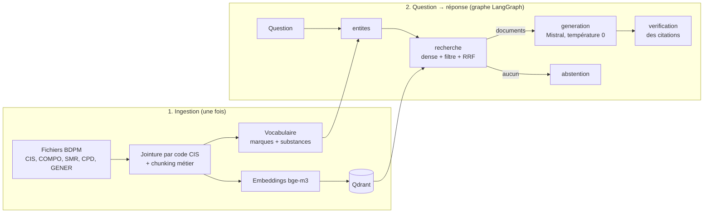

# 💊 BDPM-RAG — assistant médicament sourcé et 100 % local

Assistant de questions-réponses sur le médicament, construit sur la **Base de Données Publique des
Médicaments** (BDPM, ANSM / HAS / Assurance Maladie). Il répond **uniquement** à partir des données
officielles, **cite ses sources** (lien vers la fiche BDPM) et **s'abstient** quand l'information
n'est pas dans la base.

Tout tourne en local : LLM et embeddings via **Ollama**, index vectoriel **Qdrant**, orchestration
**LangGraph**. Aucune donnée ne quitte la machine, une exigence fréquente dans le domaine de la santé.

> ⚠️ Démonstrateur technique : ne remplace ni le RCP ni l'avis d'un professionnel de santé.

**Stack** : Python · Ollama (`bge-m3`, `mistral`) · Qdrant · LangGraph · Streamlit · pytest · GitHub Actions

---

## Le principe du RAG

Un LLM seul répond « de mémoire » : il peut se tromper, inventer une posologie ou s'appuyer sur des
informations périmées. Le **RAG** (*Retrieval-Augmented Generation*) procède autrement. On
**cherche** d'abord les passages pertinents dans une base de référence, puis on demande au LLM de
répondre **uniquement à partir de ces passages**, en les citant.

Le projet suit les deux phases classiques d'un RAG.



### Phase 1 — Ingestion (`scripts/ingest.py`)

| Étape | Ce qui se passe | Code |
|---|---|---|
| **1. Collecte** | Téléchargement des 5 fichiers open data de la BDPM (texte tabulé, encodage UTF-8 ou Windows-1252 géré) | [`bdpm.py`](bdpm_rag/bdpm.py) |
| **2. Jointure** | Les tables sont reliées par le **code CIS**, l'identifiant unique de chaque spécialité | [`documents.py`](bdpm_rag/documents.py) |
| **3. Chunking métier** | Une spécialité correspond à une unité de sens : **1 « fiche »** par médicament (identité, composition, prescription, statut générique) + **1 chunk par avis SMR** de la HAS (les 3 plus récents). Chaque chunk commence par le nom du médicament (*contextual chunk header*) et porte des métadonnées : CIS, URL, mots-clés | [`documents.py`](bdpm_rag/documents.py) |
| **4. Vectorisation** | Chaque chunk est transformé en vecteur par `bge-m3` (modèle d'embeddings multilingue) | [`llm.py`](bdpm_rag/llm.py) |
| **5. Indexation** | Les vecteurs et métadonnées sont stockés dans **Qdrant** (mode fichier local par défaut). Un **vocabulaire** des noms de marque et des substances est sauvegardé à part | [`store.py`](bdpm_rag/store.py) |

Exemple réel des deux types de chunks pour une spécialité :

```
Médicament : XARELTO 20 mg, comprimé pelliculé (code CIS 67071218)
Forme pharmaceutique : comprimé pelliculé ; voie(s) d'administration : orale
Substance(s) active(s) : RIVAROXABAN 20 mg (pour un comprimé)
Titulaire de l'AMM : BAYER AG (ALLEMAGNE)
Statut : Autorisation active (Procédure centralisée), AMM du 09/12/2011, Commercialisée
Conditions de prescription et de délivrance : liste I
Groupe générique : RIVAROXABAN 20 mg - XARELTO 20 mg, comprimé pelliculé — ce médicament en est le princeps.
```
```
Médicament : XARELTO 20 mg, comprimé pelliculé (code CIS 67071218)
Avis de la HAS (Commission de la transparence) du 02/06/2021 — motif : Extension d'indication
Service médical rendu (SMR) : Important
Le service médical rendu par XARELTO (rivaroxaban) est important dans l'indication de l'AMM.
```
Mots-clés associés (métadonnées) : `XARELTO`, `RIVAROXABAN`.

### Phase 2 — Question → réponse (`bdpm_rag/graph.py`)

Le pipeline est un **graphe LangGraph** : chaque nœud lit et enrichit un état partagé.

1. **`entites`** : la question est normalisée (majuscules, sans accents) et comparée au vocabulaire
   pour repérer les médicaments et substances cités.
   *« Quel est le SMR de Xarelto ? »* → `["XARELTO"]`
2. **`recherche`** : c'est une **recherche hybride**. Les embeddings captent bien le sens mais mal
   les noms propres (« Xarelto » n'évoque rien au modèle). On combine donc :
   - une **recherche dense** (similarité cosinus entre la question et les chunks) ;
   - une **recherche filtrée** sur les chunks dont les mots-clés contiennent les entités détectées ;
   - une **fusion des deux classements par RRF** (*Reciprocal Rank Fusion*, poids 2 pour la liste
     filtrée). Les 6 meilleurs chunks sont retenus.
3. **`generation`** : Mistral reçoit les extraits numérotés `[1]…[6]` et un prompt strict :
   répondre uniquement à partir des extraits, citer chaque affirmation, ne jamais inventer de
   posologie ou d'interaction, et utiliser une phrase d'abstention imposée sinon. La température
   est à 0.
4. **`verification`** : un contrôle déterministe signale une réponse sans citation ou citant un
   extrait inexistant (ex. `[9]` alors qu'il n'y a que 6 extraits).
5. **`abstention`** : si la recherche ne renvoie rien, le pipeline répond la phrase de refus sans
   appeler le LLM.

L'interface Streamlit ([`app.py`](app.py)) rend les citations cliquables vers les fiches officielles
et affiche les extraits utilisés.

---

## Sources

### Données

**[Base de Données Publique des Médicaments](https://base-donnees-publique.medicaments.gouv.fr/telechargement)**,
publiée par l'ANSM, la HAS et l'Assurance Maladie, mise à jour régulièrement.

| Fichier | Contenu utilisé |
|---|---|
| `CIS_bdpm.txt` | Spécialités : dénomination, forme, voies, statut et date d'AMM, titulaire, commercialisation, surveillance renforcée |
| `CIS_COMPO_bdpm.txt` | Composition : substances actives et dosages |
| `CIS_HAS_SMR_bdpm.txt` | Avis de la Commission de la transparence (HAS) sur le Service Médical Rendu |
| `CIS_CPD_bdpm.txt` | Conditions de prescription et de délivrance |
| `CIS_GENER_bdpm.txt` | Groupes génériques (princeps / génériques) |

Par défaut, seules les spécialités **commercialisées** sont indexées.

Ces données sont réutilisées sous licence ouverte, sans altération. La date de mise à jour est celle
des fichiers téléchargés. Cette réutilisation n'implique aucune caution de l'ANSM, de la HAS ou de
l'UNCAM.

### Modèles et outils

- **[bge-m3](https://ollama.com/library/bge-m3)** (BAAI) : embeddings multilingues
- **[Mistral 7B](https://ollama.com/library/mistral)** (Mistral AI) : génération, modifiable via `LLM_MODEL`
- **[Ollama](https://ollama.com)**, **[Qdrant](https://qdrant.tech)**, **[LangGraph](https://langchain-ai.github.io/langgraph/)**, **[Streamlit](https://streamlit.io)**

---

## Résultats

Mesures réalisées sur le **corpus complet** des spécialités commercialisées (BDPM téléchargée en
octobre 2026) : **13 650 spécialités commercialisées (sur 15 883) → 22 248 chunks**, vocabulaire de 6 715 termes. Indexation en
**36 min** sur CPU (MacBook, ~10 chunks/s).

### Recherche : dense vs hybride

`python -m scripts.evaluate --k 5`, sur les 15 questions annotées de
[`eval/questions.jsonl`](eval/questions.jsonl) (marques, substances, SMR, princeps/générique,
conditions de prescription) :

| Recherche | Hit@5 | MRR |
|-----------|-------|-----|
| Dense seule (bge-m3) | 0.93 | 0.86 |
| **Hybride (entités + dense, RRF)** | **1.00** | **0.96** |

- **Hit@5** : part des questions pour lesquelles un document pertinent figure dans les 5 premiers.
- **MRR** (*Mean Reciprocal Rank*) : moyenne de 1/rang du premier document pertinent (1 = toujours
  en tête).

La recherche hybride corrige précisément les cas où le dense échoue sur un nom propre :

| Question | Rang (dense) | Rang (hybride) |
|---|---|---|
| Quels anticoagulants oraux à base d'apixaban existent ? | absent du top 5 | **1** |
| Quels médicaments à base de semaglutide sont commercialisés ? | 2 | **1** |
| Existe-t-il des génériques de l'atorvastatine ? | 3 | 3 |
| 12 autres questions | 1 | 1 |

### Exemples de réponses générées (Mistral 7B, corpus complet)

**« Levothyrox est-il un princeps ou un générique ? »** ✅
> Levothyrox est le princeps des médicaments LEVOTHYROXINE SODIQUE 50, 100, 125, 150, 175 et
> 200 microgrammes, comprimé sécable […] [1][2][3][4][6]

**« Quel est le service médical rendu de Xarelto ? »** ✅
> Le service médical rendu de Xarelto (rivaroxaban) est important dans le traitement des thromboses
> veineuses profondes et embolies pulmonaires […] [1][2][3][4][5]
> En outre, Xarelto 2,5 mg […] est faible uniquement chez les patients adultes présentant une
> artériopathie oblitérante des membres inférieurs sévère […] [6]

**« Quelle est la posologie du Doliprane chez l'enfant ? »** ✅ abstention correcte, car les
posologies ne sont pas dans les données indexées
> Je ne trouve pas d'information suffisante dans la Base de Données Publique des Médicaments pour
> répondre à cette question. […]

**« Quelles sont les conditions de prescription d'Ozempic ? »** ⚠️ réponse à côté
> Le modèle détaille les **indications** remboursées tirées des avis SMR, alors que la bonne réponse
> (« **liste I** ») figurait dans l'extrait [2]. La recherche a fonctionné ; c'est la génération
> qui s'est trompée de focus (voir *Limites*).

**Latence** : 25 à 65 s par réponse sur CPU, presque entièrement due à la génération par Mistral 7B.

---

## Limites

**Périmètre des données**
- Seuls les champs **structurés** de la BDPM sont indexés. Les **notices et RCP** (indications,
  posologies, contre-indications, effets indésirables, interactions) ne le sont pas. Le système
  s'abstient donc sur ce type de question, ce qui est voulu, mais limite fortement son utilité
  clinique.
- Seuls les **3 avis SMR les plus récents** par spécialité sont gardés, tronqués à 1 500 caractères.
  Les avis d'**ASMR** ne sont pas inclus.
- Les données sont figées à la date du téléchargement. Il faut relancer l'ingestion pour les
  rafraîchir.

**Recherche**
- La détection d'entités est **lexicale et exacte**. Une faute de frappe (« Xareltoo »), un nom de
  moins de 4 lettres ou une abréviation ne sont pas reconnus, et le système se rabat alors sur la
  recherche dense, peu fiable sur les noms propres.
- Le vocabulaire contient des **mots courants** issus de noms de marque (`CHEZ`, `MEDICAL`, `DANS`…) :
  « Quel est le service médical rendu de Xarelto ? » déclenche aussi l'entité `MEDICAL`. Le poids de
  la fusion RRF limite l'impact, mais une liste d'exclusion plus complète serait nécessaire.
- Il n'y a ni recherche lexicale complète (BM25) ni *reranker*.
- Les questions « de liste » (« tous les médicaments à base de X ») sont limitées par le top-6 :
  la réponse ne peut pas être exhaustive.

**Génération et vérification**
- La vérification contrôle la **forme** des citations, pas la **fidélité** de la réponse. Une phrase
  mal résumée mais correctement citée passe le contrôle.
- Mistral 7B reste un petit modèle : il peut **se tromper de focus** même quand la recherche est
  bonne. Sur Ozempic, il a détaillé les indications au lieu des conditions de prescription
  (« liste I »), pourtant présentes dans les extraits. Il peut aussi ajouter des conseils
  généraux après la phrase d'abstention.
- **Latence de 25 à 65 s** par réponse sur CPU, peu adaptée à un usage interactif sans GPU ou modèle
  plus léger.

**Évaluation**
- Le jeu de test est **petit (15 questions)**, rédigé à la main et n'évalue que la **recherche**.
  Le score parfait de l'hybride sur 15 questions ne garantit pas la même performance en général.
- Le critère est permissif : une question est réussie si le terme attendu apparaît dans un des k
  chunks, pas si la *bonne fiche* est retrouvée.
- La qualité des réponses générées (exactitude, fidélité, abstention à bon escient) n'est pas
  mesurée.

**Technique**
- Qdrant en mode fichier n'accepte qu'**un seul processus à la fois** : il faut arrêter Streamlit
  avant de lancer `ingest`, `ask` ou `evaluate`, ou passer en mode serveur (`docker compose up -d`).
- L'indexation complète prend environ **36 minutes sur CPU** (22 248 chunks). Au-delà de 20 000
  points, Qdrant recommande le mode serveur plutôt que le mode fichier.

---

## Lancer le projet

Prérequis : Python 3.10+ et [Ollama](https://ollama.com) lancé.

```bash
git clone https://github.com/Yami9898/bdpm-rag.git && cd bdpm-rag
python -m venv .venv && source .venv/bin/activate   # Windows : .venv\Scripts\activate
pip install -r requirements.txt
cp .env.example .env

ollama pull bge-m3      # embeddings
ollama pull mistral     # LLM

# Démo rapide : 500 premières spécialités (ordre alphabétique, ~1-2 min)
python -m scripts.ingest --download --limit 500
# Ou corpus complet des médicaments commercialisés (~35-40 min sur CPU)
python -m scripts.ingest --download

streamlit run app.py                                         # interface web
python -m scripts.ask "Quel est le SMR de Xarelto ?"         # ligne de commande
python -m scripts.evaluate --k 5                             # évaluation de la recherche
pytest -q                                                    # tests (sans Ollama)
```

> Avec `--limit 500`, seuls les médicaments dont le nom commence par « A » environ sont indexés :
> une question sur le Doliprane donnera alors (à juste titre) une abstention.

Qdrant fonctionne en mode fichier (`data/qdrant`). Pour le mode serveur et son tableau de bord :
`docker compose up -d`, puis `QDRANT_URL=http://localhost:6333` dans `.env`.

## Tests

Les tests ([`tests/`](tests/)) tournent **sans Ollama** : ils utilisent un embedder et un LLM
factices, et Qdrant en mémoire. Ils couvrent le parsing BDPM (y compris l'encodage Windows-1252 des fichiers officiels), le
chunking, la recherche hybride, le graphe complet, la détection des citations invalides et
l'abstention. Ils sont exécutés en CI via GitHub Actions.

## Structure

```
bdpm_rag/
  bdpm.py        téléchargement et parsing des fichiers BDPM
  documents.py   chunking, normalisation, vocabulaire d'entités
  store.py       index Qdrant, recherche hybride, RRF
  llm.py         clients Ollama (embeddings, chat)
  graph.py       graphe LangGraph : entités → recherche → génération → vérification
  config.py      configuration (.env)
scripts/         ingest, ask, evaluate
app.py           interface Streamlit
eval/            questions annotées
tests/           tests hors ligne + fixtures au format BDPM
```

## Pistes d'évolution

- Indexer les **notices et RCP** par section (indications, contre-indications, interactions).
- **Recherche lexicale complète** (BM25) et **reranker** cross-encoder ; détection d'entités
  tolérante aux fautes (fuzzy matching).
- **Graphe de connaissances** (médicament → substance → classe ATC, thésaurus des interactions de
  l'ANSM) interrogé en GraphRAG.
- Évaluation de la **génération** (fidélité, pertinence, abstention) avec un LLM juge, sur un jeu de
  questions élargi.
- Rafraîchissement automatique mensuel de la BDPM.
