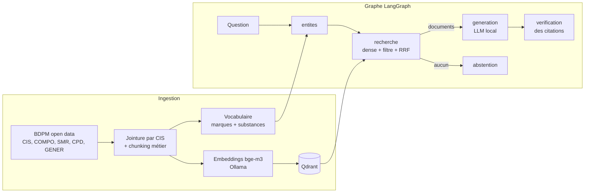

# 💊 BDPM-RAG — assistant médicament fiable, sourcé et 100 % local

Assistant de questions-réponses sur le médicament construit sur la **Base de Données Publique des
Médicaments** (ANSM / HAS / Assurance Maladie). Il répond **uniquement** à partir des données
officielles, **cite ses sources** (lien vers la fiche BDPM) et **s'abstient** quand l'information
n'est pas dans la base.

Tout tourne en local : LLM et embeddings via **Ollama**, index vectoriel **Qdrant**, orchestration
**LangGraph**. Aucune donnée ne quitte la machine, une exigence courante en santé.

> Démonstrateur technique : ne remplace ni le RCP ni l'avis d'un professionnel de santé.

## Ce que fait le projet

- **Ingestion** des fichiers open data de la BDPM (spécialités, compositions, avis SMR de la HAS,
  conditions de prescription, groupes génériques), jointure par code **CIS**.
- **Chunking orienté métier** : une fiche par spécialité + un chunk par avis SMR, chacun préfixé par
  le nom du médicament (*contextual chunk header*) et porteur de métadonnées (CIS, URL, mots-clés).
- **Recherche hybride** : les embeddings denses (`bge-m3`, multilingue) gèrent mal les noms de
  marque ; le pipeline reconnaît les médicaments et substances cités dans la question (vocabulaire
  extrait de la BDPM), filtre Qdrant sur ces entités, puis fusionne avec la recherche sémantique
  (*Reciprocal Rank Fusion*).
- **Génération contrainte** : prompt « contexte uniquement », citations `[n]` obligatoires,
  phrase d'abstention imposée, température 0.
- **Vérification** : un nœud LangGraph contrôle la présence et la validité des citations et
  signale toute réponse non sourcée.
- **Évaluation** : Hit@k et MRR, recherche dense vs hybride, sur un jeu de questions annoté.
- **Interface Streamlit** avec citations cliquables vers les fiches officielles.

## Architecture



## Démarrage rapide

Prérequis : Python 3.10+ et [Ollama](https://ollama.com).

```bash
git clone <ce-repo> && cd bdpm-rag
python -m venv .venv && source .venv/bin/activate   # Windows : .venv\Scripts\activate
pip install -r requirements.txt
cp .env.example .env

ollama pull bge-m3      # embeddings multilingues
ollama pull mistral     # LLM de génération (modifiable via LLM_MODEL)

# Démo rapide (500 spécialités, quelques minutes sur CPU)
python -m scripts.ingest --download --limit 500
# Corpus complet des médicaments commercialisés
python -m scripts.ingest --download

python -m scripts.ask "Quelles sont les conditions de prescription d'Ozempic ?"
streamlit run app.py
```

Qdrant fonctionne par défaut en mode embarqué (fichiers dans `data/qdrant`). Pour le mode serveur
et son tableau de bord : `docker compose up -d` puis `QDRANT_URL=http://localhost:6333` dans `.env`.

## Évaluation

```bash
python -m scripts.evaluate --k 5
```

| Recherche | Hit@5 | MRR |
|-----------|-------|-----|
| Dense     | _à compléter_ | _à compléter_ |
| Hybride   | _à compléter_ | _à compléter_ |

Le jeu `eval/questions.jsonl` couvre des questions par marque, par substance, sur le SMR, le
statut princeps/générique et les conditions de prescription.

## Tests

```bash
pytest -q
```

Les tests tournent sans Ollama (embedder et LLM factices, Qdrant en mémoire) et couvrent le parsing
BDPM (y compris l'encodage ISO-8859-1), le chunking, la recherche hybride, le graphe complet,
la détection des citations invalides et l'abstention. Ils sont exécutés en CI via GitHub Actions.

## Structure

```
bdpm_rag/
  bdpm.py        téléchargement et parsing des fichiers BDPM
  documents.py   chunking, normalisation, vocabulaire d'entités
  store.py       index Qdrant, recherche hybride, RRF
  llm.py         clients Ollama (embeddings, chat)
  graph.py       graphe LangGraph : entités → recherche → génération → vérification
scripts/         ingest, ask, evaluate
app.py           interface Streamlit
eval/            questions annotées
tests/           tests hors-ligne + fixtures au format BDPM
```

## Pistes d'évolution

- **Graphe de connaissances (Neo4j)** : médicament → substance → classe **ATC**, groupes
  génériques, et thésaurus des interactions médicamenteuses de l'ANSM, interrogés en GraphRAG.
- **Notices et RCP** : indexer les sections (indications, contre-indications, interactions).
- **Recherche lexicale complète** (BM25 / OpenSearch) et reranker cross-encoder.
- **Rafraîchissement mensuel** de la BDPM orchestré avec Prefect.
- Exposer la recherche comme **serveur MCP** pour d'autres agents.
- Évaluation de la génération (fidélité, pertinence) avec un LLM juge.

## Données et licence

Source : [Base de Données Publique des Médicaments](https://base-donnees-publique.medicaments.gouv.fr),
données réutilisées sous licence ouverte, sans altération ; la date de mise à jour est celle des
fichiers téléchargés. Cette réutilisation n'implique aucune caution de l'ANSM, de la HAS ou de l'UNCAM.
